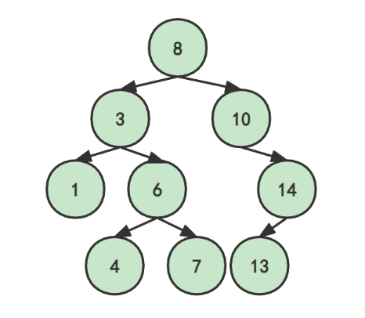
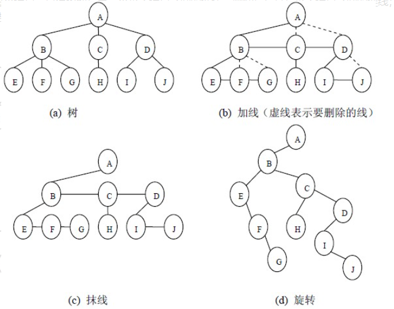
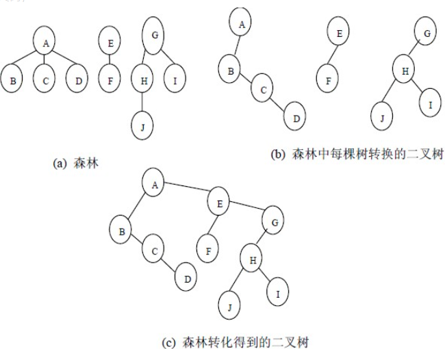
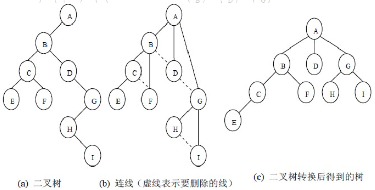

# 树

## 完全二叉树

+ 除最后一层外，其余层节点达到最大值
+ 最后一层所有节点连续集中靠左

深度为`h`的完全二叉树，最少有**2^(n-1)^** 个节点

## 二叉排序树

二叉排序树**若不为空**则满足：

+ 左孩子的值小于根
+ 右孩子的值大于根
+ 选定任意节点为根均满足上述

  

1. 对于二叉排序树，其**中序遍历**为**顺序输出**

### 二叉排序树的添加

+ 比节点大则遍历其右子树
+ 比节点小则遍历其左子树
+ 重复直到找到空

## 树，森林，二叉树转换

### 树转化二叉树

1. 加线。就是在所有兄弟结点之间加一条连线；
1. 抹线。就是对树中的每个结点，只保留他与第一个孩子结点之间的连线，删除它与其它孩子结点之间的连线；
1. 旋转。就是以树的根结点为轴心，将整棵树顺时针旋转一定角度，使之结构层次分明。

  

树转化二叉树后，若非空，则**仅存在左子树**

### 森林转化二叉树

1. 先把每棵树转换为二叉树；
1. 第一棵二叉树不动，从第二棵二叉树开始，依次把后一棵二叉树的根结点作为前一棵二叉树的根结点的右孩子结点，用线连接起来。当所有的二叉树连接起来后得到的二叉树就是由森林转换得到的二叉树。

  

### 二叉树转化树

1. 若某结点的左孩子结点存在，将左孩子结点的右孩子结点、右孩子结点的右孩子结点……都作为该结点的孩子结点，将该结点与这些右孩子结点用线连接起来；
1. 删除原二叉树中所有结点与其右孩子结点的连线；
1. 整理（1）和（2）两步得到的树，使之结构层次分明。

链接**根**与其**第一个左孩子**的**所有右孩子**

  

### 二叉树转化森林

+ 链接所有的根与其左孩子的所有右孩子，以及右孩子的右孩子
+ 删除原有向右的连线
+ ~~有没有发现这和二叉树转化树没有区别~~

  

## 根据序列建树

### 前序/后序与中序建树

#### 建树方法

### 前序后序建树（多结果）

#### 建树方法

>前序：SACEFBDGHIJK
后序：CFEABHGIKJDS

由前序序列正向找到根`S`，去后序序列中寻找该根 *CFEABHGIKJD**S***，寻找后序序列中该节点前***CFEABHGIKJD**S* 是否存在前序序列中该节点后 *S**ACEFBDGHIJK*** 的元素，存在则前序序列的下一元素`A`为孩子，并将其作为新的根节点。若后序序列中该节点前不存在其他未排序元素，则该节点为叶子节点，前序序列下一个元素为上一级根的新的孩子。重复以上

>               S
>              /
>             A

`root==A`  ***CFE**ABHGIKJDS* *SA**CEF**BDGHIJK*
C为左孩子

>               S
>              /
>             A
>            /
>           C

后序中`C`前不存在其他未排序元素（后序：左右根，说明C没孩子节点），C为叶子节点
前序序列下一元素为`E`，后序中E前有F，F前无其他，F为叶子

>               S
>              /
>             A
>            / \
>           C   E
>                \
>                 F

前序下一元素`B`在根节点`A`的后面，寻找`A`的父节点`S`，B是S的孩子
后序中B前无其他，B为叶子

>               S
>             / |
>            A  B
>           / \
>          C   E
>               \
>                F

重复可得

>                  S
>               /  |  \
>            A     B     D
>           / \        / | \
>          C   E      G  I  J
>               \    /       \
>                F  H         K

#### 多解

共有**2^n^**个可能的树。因所有的独生子女节点（不存在兄弟节点）均不能确定是左孩子还是右孩子，**`n`**为独生子女节点的个数，上图中，`F` `H` `K`均为独生子女节点，共有`8`种可能的树